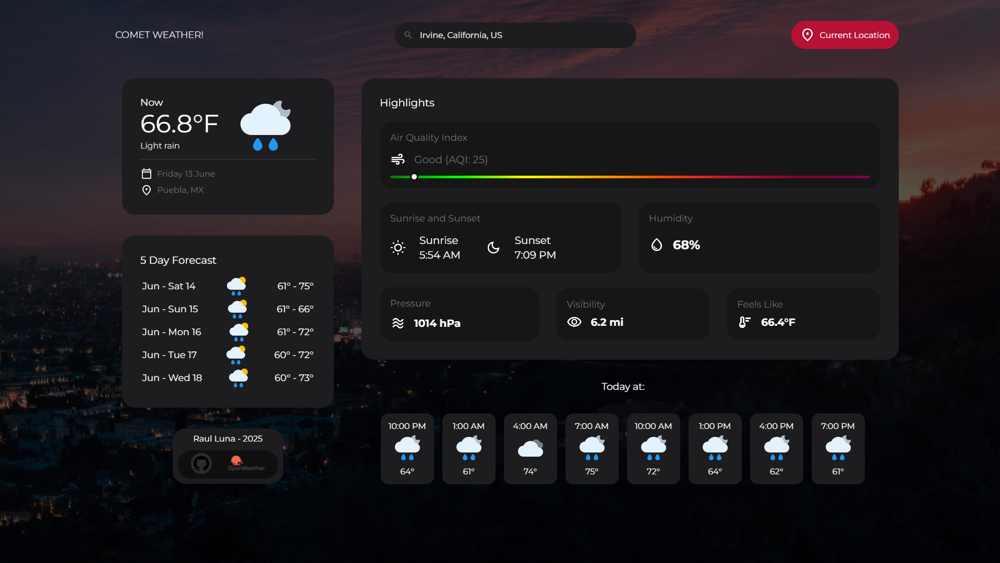

# Comet Weather:

(designed first in Figma and developed using HTML, CSS and JavaScript) Comet Weather is a highly advanced API-based weather app. With over 700 lines of JavaScript! The project is able to fetch weather data from ANY city on Earth from the search bar based on your query, including sugguestions.

The information returned once you've searched a city / location includes: Temperature, (date, time and location of the city), air quality index (AQI), time of both the sun set and sunrise, humidity, pressure, visibility, feels-like temperture, as well as a 5-day forecasts! 

And yes! It's fully responsive!

## Project Structure:

- `index.html`: The main file of the project that containers the user interface, and links up all other documents.
- `style.css`: ALL styles are located here, including ALL media queries as well!
- `main.js`: Being the main JS document, this file is crutial for providing: The (weather) API itself, A randomized background everytime the page is refreshed or opened, updating the date and time properly (based on the location), selecting (most) HTML elements, as well as for providing relevant data like: Temperature (as well as the corresponding icon), time of sunset and sunrise, humidity, pressure, feels-like temperature and visibility.
- `search-bar.js`: EVERYTHING regarding the search bar, such as user input can be found here! This includes everything ranging from suggestions, styling for suggestions, as well as properly updating weather data based on the users query!
- `forecast.js`: The 5-day forecast is provided here, based on the data from the API, the code here will estimate the weather for the current day (as well as following days) to create a forecast and displaying both the highest and lowest temperatures for those days! 
- `highlights.js`: This portion of code focuses on providing data for the Air Quality Index.
- `hourly-weather.js`: Alongside the 5-day forecast, here is where the forecast for the current day can be found! Including the highest / lowest temperature for the day, as well as corresponding icons for the hour of the day.

## Functionality

- Users can search for a city to view data based on their query.
- The application fetches real-time weather data from the OpenWeather API.
- The 5-day forecast shows the weather conditions for the next five days.
- Sunrise and sunset times are displayed for the searched city / locayion.
- Additional weather details, including air quality, humidity, visibility, feels-like temperature, and pressure, are all shown.
- The application is fully responsive and adapts to different screen sizes!
